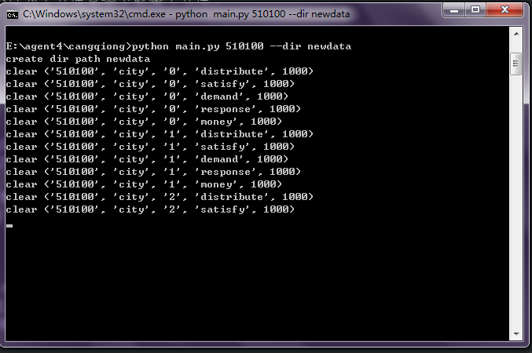

# 苍穹滴滴快的智能出行平台数据获取器

## 数据来源

http://v.kuaidadi.com/

data下有已经获取好的成都的相关数据

## 通过命令行使用脚本下载

```
$ python main.py 510100
```

其中510100是成都的城市代号，换成以下10个城市代号之一可以下不同城市的数据。

id | 城市名
-----|------
110100 | 北京市
440100 | 广州市
310100 | 上海市
210100 | 沈阳市
420100 | 武汉市
610100 | 西安市
510100 | 成都市
330100 | 杭州市
440300 | 深圳市
320100 | 南京市

## 完全新手教程

如果你知道上面的代码什么意思与如何使用，请跳过这一段。

### Python是什么？

Python是一个编程语言，与MatLab类似，不过更注重一般编程工作，`sin`之类的函数是不能直接用的。

MatLab之所以那么大是因为它自带了很多模块（特别对盗版来说），基本上99%一般人用不上。标准Python
不含有这些模块，开源的`numpy`与`scipy`模块提供了类似的科学计算功能，作为与MatLab一样调用了基于
fortran的底层模块实现矩阵运算的高度优化，所以作为脚本语言反而比（一般人写的）C语言之类编译语言更快。

当然这里只是个下载脚本，实际上根本没用科学计算的任何功能（但我下面使用数据示例中用了），我这么说
是为下载比较大的Anaconda，Python解释器与一些模块与工具已经打包好的版本找理由。如果你用标准python
装`numpy`，`scipy`这些可能要么需要再去装一个C语言编译器（如果你在Windows，你很可能发现最终需要装
一些几个G大的VS,仅仅为了使用其中的cl命令行编译器），要么去装一些其他的安装包，这么装的话就必须每一步
都手动了。。总之请直接下载Anaconda。

### 操作流程

1.下载Anaconda,<a href="https://www.continuum.io/downloads">下载连接</a>
现在请下载Anaconda for Windows下的3.x(现在是3.5)版本（2.7可能也能用，没测试过）。


2.安装，一路按默认配置就行。（如果你对编程略知一二，这时它自动配好了环境变量）

3.下载本脚本，理论上你只需要那个`.py`文件，不过为了方便直接下载整个仓库。


(Download ZIP)

I 批处理脚本方法

对CMD不熟者可以使用此法，如果你想要“下载成都的数据到当前目录newdata2文件夹下”，
就直接双击`quick_start.bat`即可，会出现类似下面CMD方法的界面。完成后自动退出。

如果你想修改下载的城市或者下载的目标文件夹，就修改`quick_start.bat`即可

用记事本打开`quick_start.bat`


修改510100为其他代码如(320100)就是表示下载其他城市的数据(320100是南京)，
而修改newdata2就是下载到其他文件名下。

II CMD方法

4.转到你保存仓库的目录（目录下有个`main.py`文件），打开命令行
（win7可以按shift右键，在此处打开命令窗口。


其他操作系统自行查询如何使用对应命令行，
这个脚本本身应该是跨平台的，就是mac,linux都可以用）。

(上面代码中`$`可以看成本图本图的`E:\agent4\cangqiong>`，即这个仓库在我的系统上的保存位置，
因为你存的路径和我的不一定一样所以用`$`表示这个东西)。

5.这里输入`python main.py -h`然后回车可以看帮助信息（截图中中间一部分），
这里相比之前的介绍多了一个`--dir`选项，意思看下面例子


然后输入，最下面输入了但还没回车确认执行的命令`python main.py 510100 --dir newdata`。
意思是下载城市代号为510100的城市（是成都，见上表）的相关数据到newdata文件夹中，
你可以修改`510100`与`newdata`为其他值来定制它的行为。

6.回车确认，它会开始执行下载



一分钟内就可以下到过去一周的相关数据

在`newdata`文件夹中就可以看到类似`data`示例文件夹中的数据格式


## 数据获取流程以及其原来的含义

该平台所能看到的原始数据是这样的


2016年3月23日出租车分布可视化图中一个数据点。这些数据点
在各时间点并非固定，可能是根据某种焦点规则汇总更基本的出
租车个体数据生成，在各类下可能还有更进一步的信息，这里没有获取


这些动态加载的前端数据浏览器既然获取得到，就可以查到是在哪获取
的，这里使用了Chrome的开发人员工具，按F12打开，Network下会有
各个get/post请求的请求信息与返回值，找到下述JSON格式文件记录
了上述可视化所用信息。其流程大致是你打开某城某类视图后，页面的JS
脚本会请向苍穹的服务器请求这些JSON数据，然后用这些JSON数据绘图，
所以这些JSON数据就应当表达了所有前端能看到的信息。

该程序所做的事就是批量下载这些JSON数据以及将它们中主要信息以CSV
表格等易处理的表格的形式输出。虽然事实上JSON数据可能还更容易处理一些。


找到第一张图中在JSON数据中的记录


结合上面两张图可以看到JSON字符串中的主要信息是data列表，data列表
又由24个列表组成，这24个中的每一个有一个形如`["",x,y,z]`的列表
组成。容易猜出每个这样的记录表示对应经纬度的一个数据点(在这里前两个数值表示经纬度
,第三个数值表示这个数据点对应的出租车分布数量，其他类型(打车难易度等)
页面发来的JSON具有完全相同的的格式但是第三个数值的意义不同)。而处于
24个列表中的不同个则表示在当天的不同小时数。

结合这些信息，就可以将它们输出为标准化的csv表格。


### 充分信息的体现

既然这些JSON对于显示前端可视化界面具有充分的信息，那么就只能
推出诸如"满意","一般","困难"这些tag是从`["",x,y,z]`中的`z`
通过某种处理而来。通过搜索各个JS脚本。可以发现出现了这三个
字符串的只有这一处


有理由相信这里就包含了如何将`z`(csv表格中的value)映射成三个字符串
之一的算法，用Chrome自带的代码格式化工具可以看得更清楚。


因为这些代码进行了压缩和混淆，所以直接通过程序去分析映射如何实现是
费力不讨好的。然而容易看出它将`z`分成了三个区间，`(-oo,3.3],(3.3,7.7],(7.7,+oo)`
处理，那么显然就是将`z`值落到三个区间中的哪一个就输出对应的值。
至于这段代码里的`y`,`m`是什么根本不重要。不过可以看出很多地方是给绘图
做准备，与实际目的无关，故而无视。

### csv表格头部数据类型的来历


`Query String Parameters`那里是get请求的参数，不同类型的页面会以相同的参数
但不同的参数值请求JSON文件。那个`dimension`就是我用来区分数据类型的键。

另外上面区间分类代码中的demand似乎会引来误解，我感觉这个demand应该实际是
satisfy的JSON文件记录在代码中的字段名，这可能是个遗留问题，说不定以前这个
satisfy叫做demand，后来换了（文件）名字但相关渲染代码没有换名字。

## 解释

比如data下有这么个文件

`demand_2016.03.10_510100_.csv`

名称头部是数据类型

* demand 打车需求量
* distribute 出租车分布
* money 车费
* response 被抢单时间
* satisfy 打车难易度

然后是日期2016.03.10，城市编号510100（这里只包括成都510100的为减小仓库大小）

`.csv`文档即逗号分隔符文档。R语言,Python,Matlab读起来应该都很容易。WPS,Excel也可以读取或者存成这个格式。

数据里面都是id,经度,纬度,值(不同类型值的意思不一样)的记录模式。

## 使用脚本

### Python版本

这个代码写的时候是用Python2.7，现在是用Python3.4运行。没去测试Python2.7是否还能运行。

### 代码

下载脚本是Python写的，主要是如果想下其他城市的数据可以用它，去修改`Downloader`类里`cityId_list`的值，
现在这个列表里只有成都的代号。

下载执行

		downloader=Downloader()
		downloader.download()
		to_csv_all(downloader.data)

### 依赖项

脚本本身是Python写的，下载用了`requests`包，输出csv用了`pandas`包，安装可以
先下标准Python再用pip下载这两个包，若直接装科学计算发行版Anaconda则都自带了不用
专门处理。

比如在Anaconda里运行代码就是打开我的`.py`文件然后F5加载，再复制下面三个代码到
交互式命令行里运行即可。我建议程序就在Python内部进行，pandas处理数据也比较方便
我这里是已经转成了`pandas.DataFrame`对象，再输出的csv，在pandas内部回归,作图
什么的就一行命令的事。

### pandas示例

我先从文件夹里加载一个文件，再做一个曲线图。

```ipython
In [1]: %cd E:\agent4\cangqiong #转入仓库地址，要是用F5载入的脚本就不用这个
E:\agent4\cangqiong

In [2]: import pandas as pd #载入pandas模块

In [3]: df=pd.read_csv('data/demand_2016.03.10_510100_.csv',index_col=0) #读取一个csv文件

In [4]: df #看一下读取表格的大概样子
Out[4]:
      hour  longitude  latitude  value
0        0   104.0881   30.6660      4
1        0   103.6453   30.9870      3
2        0   103.9096   30.8013     20
3        0   104.0380   30.5877     11
4        0   103.6547   30.9764     13
5        0   103.9240   30.8149      3
6        0   104.0435   30.5587     14
7        0   103.8187   30.6971      4
8        0   103.9968   30.5818      3
9        0   104.2872   30.8255      5
10       0   104.2782   30.5789     11
11       0   104.1148   30.6521      7
12       0   104.2618   30.8867      9
13       0   104.0968   30.6594     11
14       0   104.0661   30.6762     13
15       0   104.0572   30.6076     11
16       0   104.2245   30.5480      3
17       0   103.9840   30.6398      7
18       0   104.1122   30.6957      3
19       0   103.6686   31.0074     12
20       0   104.0729   30.6080      5
21       0   103.9012   30.7936      5
22       0   104.1122   30.6860      4
23       0   103.9297   30.5883      3
24       0   104.2751   30.5614      5
25       0   103.8713   30.6907     14
26       0   104.0914   30.6049      9
27       0   103.6502   30.9608      5
28       0   104.2257   30.8954      8
29       0   104.2649   30.5826      5
...    ...        ...       ...    ...
3884    23   104.0773   30.7064      6
3885    23   104.0682   30.6899      7
3886    23   104.1657   30.5854      3
3887    23   103.6600   31.0255      3
3888    23   104.0663   30.6263      3
3889    23   104.1889   30.6623     20
3890    23   104.1001   30.6201      5
3891    23   103.8703   30.6912     10
3892    23   103.8826   30.6975      5
3893    23   103.9622   30.5815     29
3894    23   104.2605   30.5550      4
3895    23   104.0519   30.5398      5
3896    23   104.0068   30.6808     11
3897    23   103.8643   30.6589      3
3898    23   104.0700   30.6073     10
3899    23   104.0721   30.5742     16
3900    23   103.6364   30.9638     11
3901    23   104.0471   30.6188      4
3902    23   104.0612   30.6668      9
3903    23   103.8147   30.7017      9
3904    23   103.8710   30.8031      3
3905    23   104.0341   30.6495      3
3906    23   104.0184   30.7129      3
3907    23   103.8641   30.8362      6
3908    23   104.1530   30.8148      6
3909    23   104.0270   30.6383     11
3910    23   104.0865   30.6494      5
3911    23   104.2416   30.5825      5
3912    23   104.0216   30.6926      8
3913    23   103.8994   30.6095      5

[3914 rows x 4 columns]

In [5]: df['value'].groupby(df['hour']).sum().plot() #以时间分类画一张曲线图
Out[5]: <matplotlib.axes._subplots.AxesSubplot at 0xf0b2ba8>
```
        


实际上是2016/03/10成都的24小时的需求总量曲线图。

### 盐市口的打车难易度曲线

取距离盐市口最近的三个点求均值作为盐市口在此时刻的打车难易度的代理。

```python
def loc_seq(df,longitude=104.06,latitude=30.67):
    distance=np.sqrt((df['longitude']-longitude)**2+(df['latitude']-latitude)**2)
    df2=df.groupby(df['hour']).apply(lambda df:df.ix[distance.ix[df.index].sort(inplace=False)[:3].index].mean())
    df2.index=df2['hour']
    return df2

satisfy_df=pd.read_csv('data/satisfy_2016.03.10_510100_.csv')
df2=loc_seq(satisfy_df,longitude=104.06,latitude=30.67) #(104.06,30.67)是盐市口的经纬度
df2['value'].plot()
plt.title('satisfy')
plt.plot()
```


## 信度

这个数据来源不明，使用请谨慎。特别是可以看到返回的json数据里标的
realdate与date不一致，疑似是从过去某个月的时间推断的现在的数据。

另外还有些明显的异常值，比如明明是成都的数据却出现了在哈尔滨或海上的数据点之类的注意排除。

:frog: